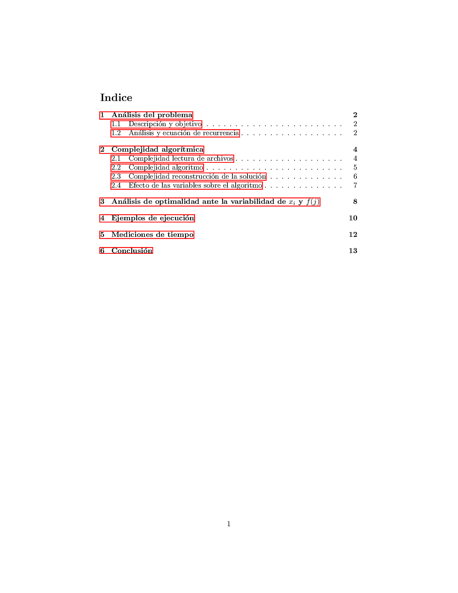
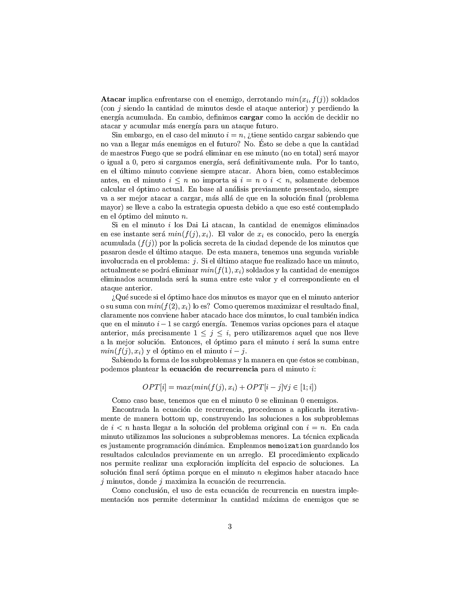
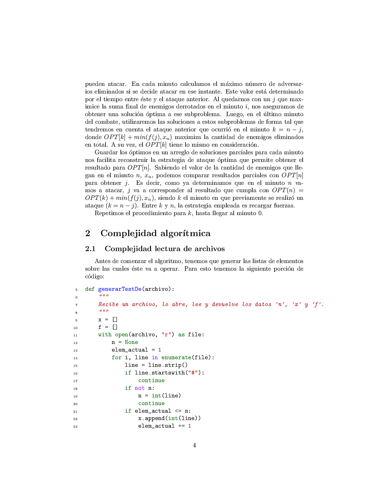
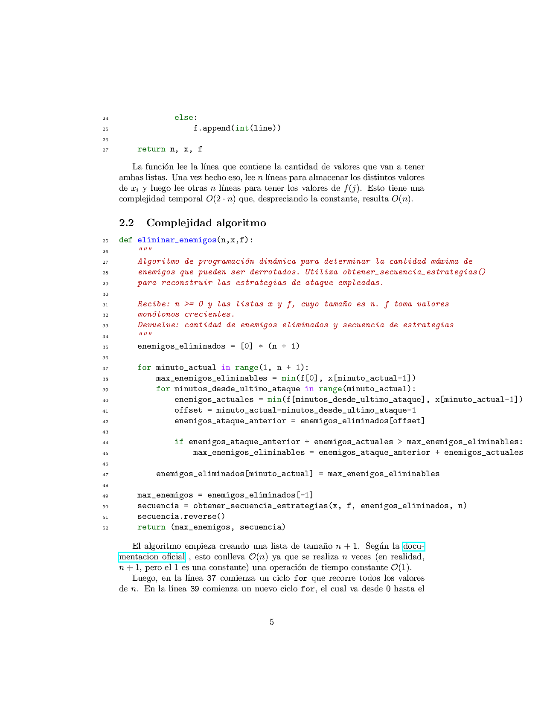
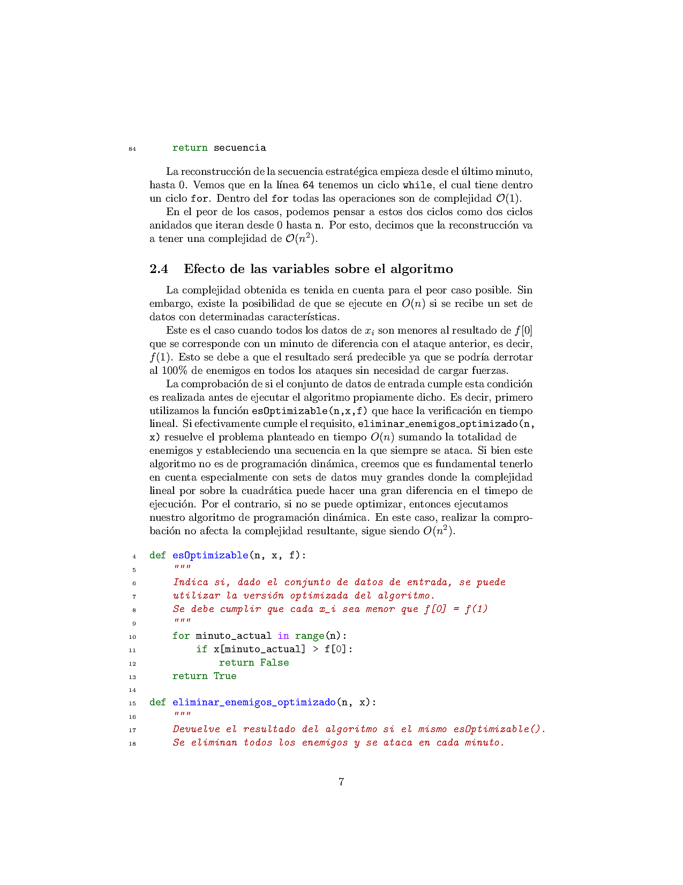
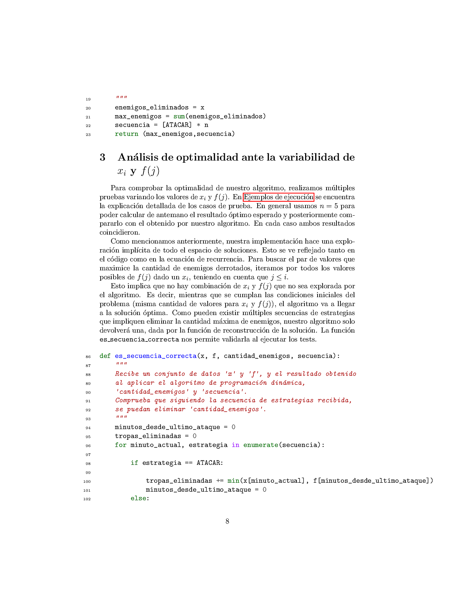
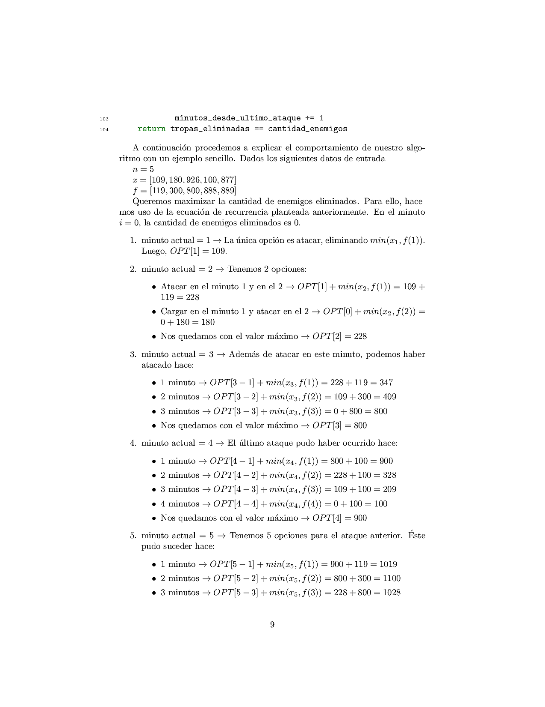
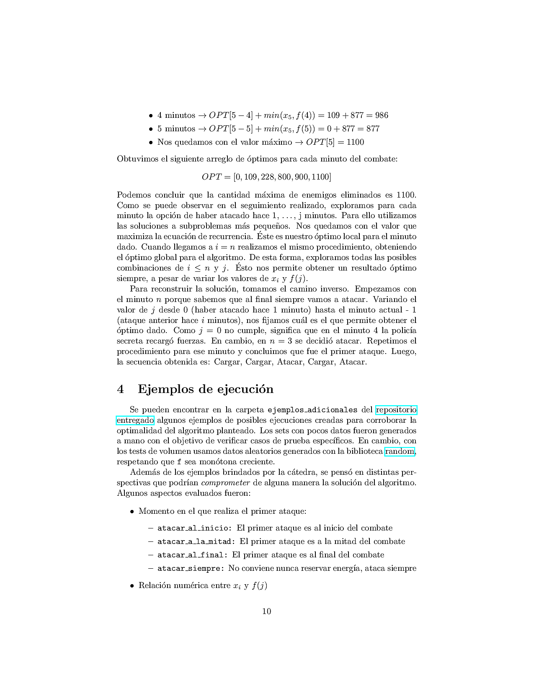

# Fecha 
6/05.

# Introducción

Es el año 80 DG. Ba Sing Se es una gran ciudad del Reino de la Tierra. Allí tiene lugar el palacio Real. Por esto, se trata de una ciudad fortificada, que ha logrado soportar durante más de 110 años los ataques de la Nación del Fuego. Los Dai Li (policía secreta de la ciudad) la defienden utilizando técnicas de artes marciales, Tierra-control, y algunos algoritmos. Nosotros somos los jefes estratégicos de los Dai Li.

Gracias a las técnicas de Tierra-control, lograron detectar que la Nación del Fuego planea un ataque ráfaga con miles de soldados maestros Fuego. El ataque sería de la siguiente forma:

- Ráfagas de soldados llegarían durante el transcurso de $n$ minutos. En el $i$-ésimo minuto llegarán $xi$​ soldados. Gracias a las mediciones sísmicas hechas con sus técnicas, los Dai Li lograron obtener los valores de $x_1,x_2, \dots , x_n$
- Cuando los integrantes del equipo juntan sus fuerzas, pueden generar fisuras que permiten destruir parte de las armadas enemigas. La fuerza de este ataque depende cuánto tiempo se utilizó para cargar energía. Más específicamente, podemos decir que hay una función $f(⋅)$ que indica que si transcurrieron $j$ minutos desde que se utilizó este ataque, entonces es capaz de eliminar hasta $f(j)$ soldados enemigos.
- Si se utiliza este ataque en el $k$-ésimo minuto, y transcurrieron $j$ minutos desde su último uso, entonces se eliminará a $min⁡(x_k,f(j))$ soldados (y luego de su uso, se utilizó toda la energía que se había acumulado).
- Inicialmente los Dai Li comienzan sin energía acumulada (es decir, para el primer minuto, le correspondería $f(1)$ de energía si decidieran atacar inmediatamente).
- La función de recarga será una función monótona creciente.

Como jefes estratégicos de los Dai Li, es nuestro deber determinar en qué momentos debemos realizar estos ataques de fisuras para eliminar a tantos enemigos en total como sea posible.
# Consigna

- Hacer un análisis del problema, plantear la ecuación de recurrencia correspondiente y proponer un algoritmo por programación dinámica que obtenga la solución óptima al problema planteado: Dada la secuencia de de llegadas de enemigos ​$x_1, x_2, \dots x_n$ y la función de recarga $f(⋅)$ (dada por una tabla, con lo cual puede considerarse directamente como una secuencia de valores), determinar la cantidad máxima de enemigos que se pueden atacar, y en qué momentos se harían los correspondientes ataques.
- Escribir el algoritmo planteado. Describir y justificar la complejidad de dicho algoritmo. Analizar si (y cómo) afecta a los tiempos del algoritmo planteado la variabilidad de los valores de las llegadas de enemigos y recargas.
- Analizar si (y cómo) afecta a la optimalidad del algoritmo planteado la variabilidad de los valores de las llegadas de enemigos y recargas
- Realizar ejemplos de ejecución para encontrar soluciones y corroborar lo encontrado. Adicionalmente, el curso proveerá con algunos casos particulares que deben cumplirse su optimalidad también.
- De las pruebas anteriores, hacer también mediciones de tiempos para corroborar la complejidad teórica indicada. Realizar gráficos correspondientes. Generar todo set de datos necesarios para estas pruebas.
- Agregar cualquier conclusión que parezca relevante.

# Entrega

Debe enviarse al corrector asignado, por mail o slack, el link al repositorio donde se encuentre el código fuente, y donde debe encontrarse el informe en formato PDF, que debe seguir los lineamientos establecidos en el TP1. Debe ser claro cómo ejecutar el programa pasando por parámetro un set de datos como los que se dan de ejemplo. Esto puede ser dentro del `README.md` del repositorio, u otra forma que les parezca clara.

La nota del trabajo práctico tendrá en cuenta tanto la presentación y calidad de lo presentado, como también el desarrollo del trabajo. No será lo mismo un trabajo realizado con lo mínimo indispensable, que uno bien presentado, analizado, y probado con diferentes volúmenes, set de datos, o estrategias de generación de sets, en el caso que corresponda.

# Ejecución del programa
Para ejecutar todos los casos de prueba existentes, mostrar la cantidad de enemigos eliminados obtenidos y esperados y mostrar el tiempo de ejecución de cada ejemplo:
```c
python3 codigo/main.py
```

Para procesar y ejecutar el caso particular almacenado en ruta_a_archivo (por ejemplo: ejemplos_catedra/100.txt) mostrando el resultado obtenido y el tiempo de ejecución implementado:
```c
python3 codigo/main.py ruta_a_archivo
```

Mismo caso que el anterior pero mostrando la secuencia de estrategias utilizadas:
```c
python3 codigo/main.py ruta_a_archivo --mostrarSecuencia
```

# Informe en pdf
[Informe](informe.pdf)

# Informe en fotos











